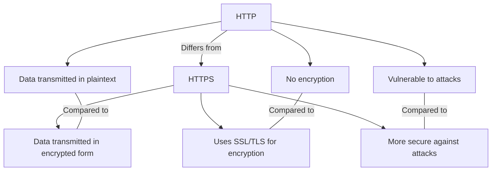

To start off, HTTP ( Hypertext Transfer Protocal) and HTTPS ( Hypertext Transfer Protocal Secure) serve as fundimental protocals between the client and the server.

That is HTTP and HTTPS?

The HTTP is a protocal or prescribed syntax for presenting information and is also used for transfering data over a network.
The HTTPS uses TLS or SSL to encrypt HTTP requests and responses.

The difference between HTTP and HTTPS:

*HTTP Request structure*

Host: www.only1techgal.com
User-Agent: Mozilla/5.0
Accept: text/html, */*
Accept-Language: en-us
Content-Type: application/json

{
    "username": "LemohangUser",
    "password": "erfoutger"
}

*HTTP Response structure*

Cintent-Type: application/json
Content-Length: 123
Date: Tuesday, 08 Oct 2024 17:08:00 ET

{
    "success": true,
    "data": {
        "id": 1
        "username": "jennlUser"
    }
}

*Common HTTP methods and status codes*

Method: Get, Description: Simply retrieves data from the server
Status code: 404, Description: Not Found, Senario: When a requested page or resource isn't available on the server

Method: Post, Description: Sends data to a server for processing
Status code: 