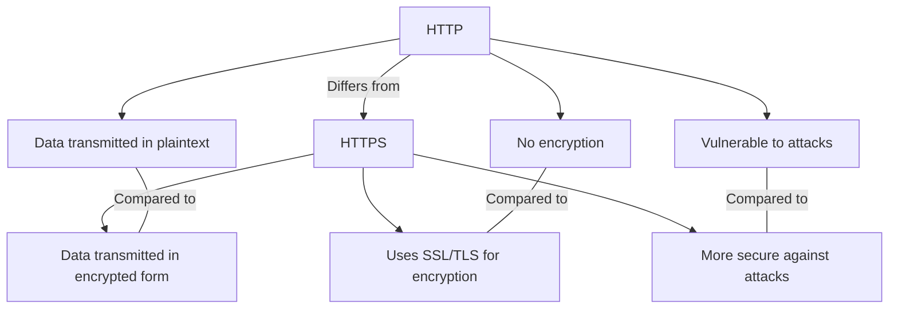

To start off, HTTP ( Hypertext Transfer Protocal) and HTTPS ( Hypertext Transfer Protocal Secure) serve as fundimental protocals between the client and the server.

That is HTTP and HTTPS?

The HTTP is a protocal or prescribed syntax for presenting information and is also used for transfering data over a network.
The HTTPS uses TLS or SSL to encrypt HTTP requests and responses.

The difference between HTTP and HTTPS:

