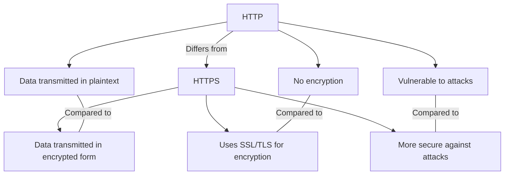

*Summary of HTTP and HTTPS*

To start off, HTTP ( Hypertext Transfer Protocal) and HTTPS ( Hypertext Transfer Protocal Secure) serve as fundimental protocals between the client and the server.

That is HTTP and HTTPS?

The HTTP is a protocal or prescribed syntax for presenting information and is also used for transfering data over a network.
The HTTPS uses TLS or SSL to encrypt HTTP requests and responses.

The difference between HTTP and HTTPS:

*HTTP Request structure*

Host: www.only1techgal.com
User-Agent: Mozilla/5.0
Accept: text/html, */*
Accept-Language: en-us
Content-Type: application/json

{
    "username": "LemohangUser",
    "password": "erfoutger"
}

*HTTP Response structure*

Cintent-Type: application/json
Content-Length: 123
Date: Tuesday, 08 Oct 2024 17:08:00 ET

{
    "success": true,
    "data": {
        "id": 1
        "username": "jennlUser"
    }
}

*Common HTTP methods and status codes*

Method: Get, Description: Simply retrieves data from the server
Status code: 404, Description: Not Found, Senario: When a requested page or resource isn't available on the server.

Method: Post, Description: Sends data to a server for processing
Status code: 201, Description: Created, Senario: When a User creates a new account and then the server creates the user profile.

Method: Head, Description: Returns metadata about a resource on the server
Status code: 200, Description: OK, Senario: A browser sends a Head request to check if the webpage has been modified without downloading the entire page.

Method: Put, Description: Replaces a resource identified with a given URL
Status code: 400, Description: Bad request, Senario: User sends incorrect data during a profile update process.

Method: Delete, Description: Removes the resource from the server after execution
Staus code: 202, Description: No content, Senario: A User deletes their account and then the server returns no additional data.

Method: Patch, Description: Allows updates of existing resources
Status code: 204, Description: No content, Senario: A User updates a resource , and then no content is returned after a update.

Method: Options, Description: Returns a list of HTTP methods which are supported and allowed
Status code: 200, Description: OK, Senario: A developer sends an options request to check which methods are allowed for a specific API endpoint, and then the server lists then in the respose headers.

Method: Trace, Description: Diagnosis, debuggs and trouble shoots
Status code: 200, Description: OK, Senario: A client sends a trace request to diagnose potential issues and the server responds with the echoed request headers and body.

Method: Connect, Description: Creates a coonection with a server-side resource.
Status code: 407, Description: Proxy authentication required, Senario: A client sends a connect request through a proxy server which requires authentication. Then the server responds with a 407 status, asking the client to provide valid credentials.
